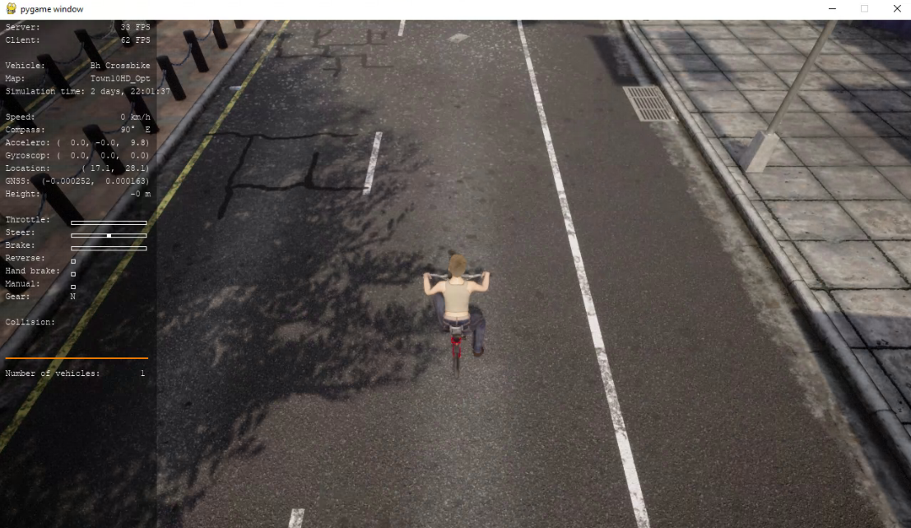
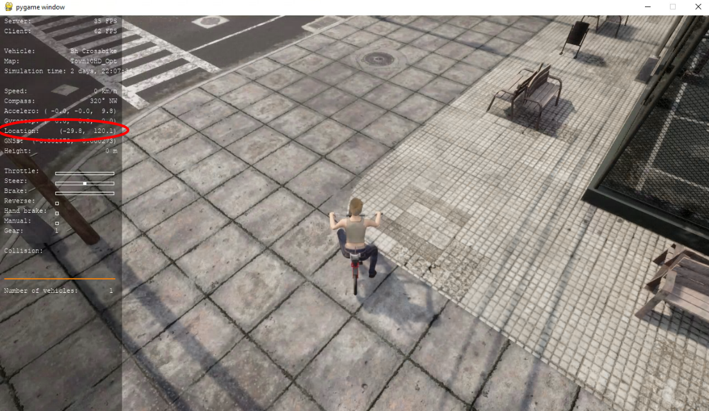
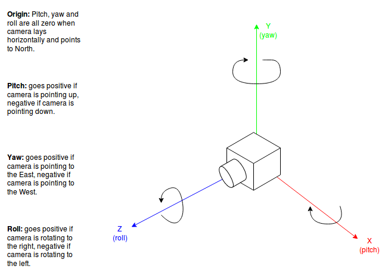
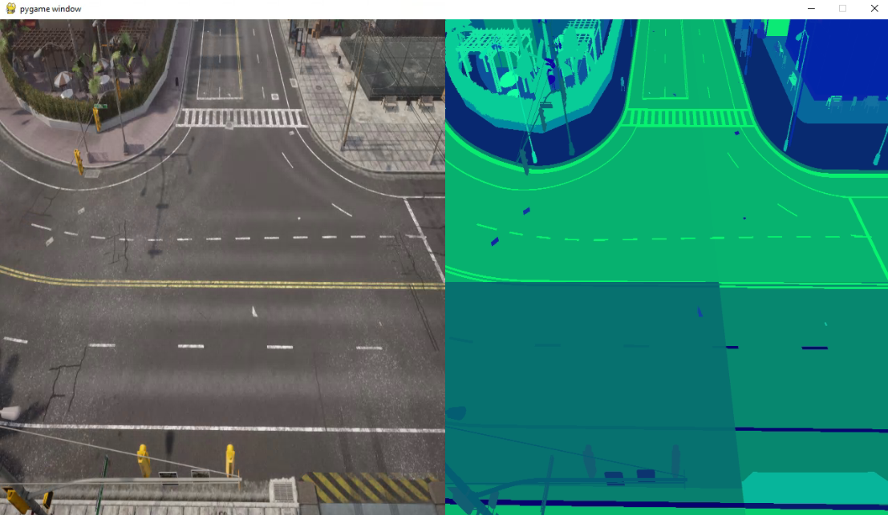
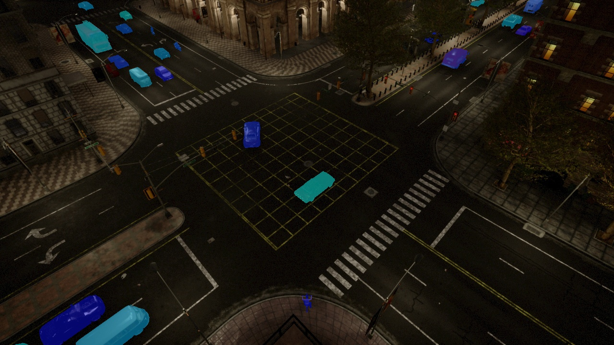
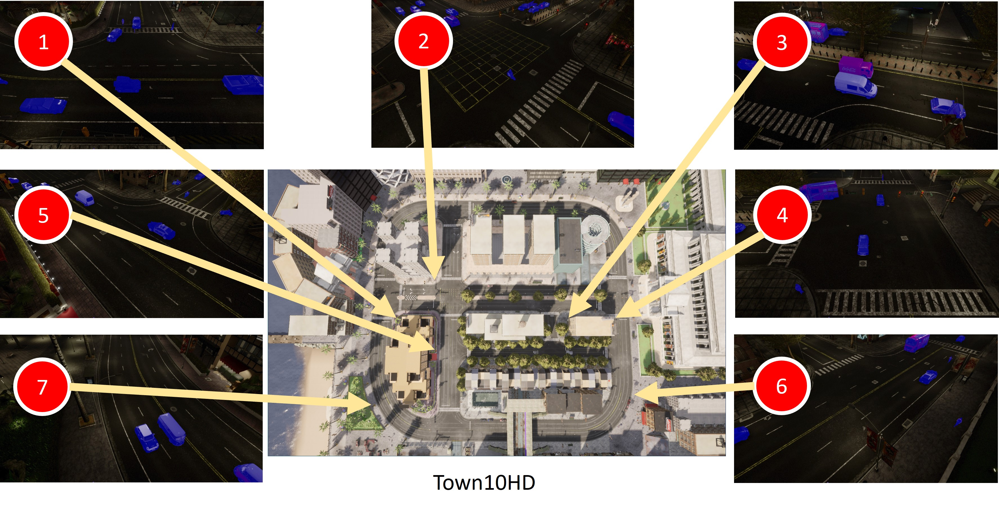

# Traffic Surveillance Dataset
Traffic Surveillance Data Generation capable of producing various environment record on road by using Carla.


## I. Finding the location on the Town

Execute the command below to manually find the location on the map.

```shell
python manual_control.py --filter vehicle.bh.crossbike
```

Press "tab" to change the change sensor (camera) position.



Using "a-s-d-w" to move the vehicle until we find the right location to capture the dataset.
At this time, we focus on recording at the intersection, or round about.



Based on the location (the red circle on image above), we get the location **(x, y)** on the map.
The location will be use the set the default parameters on next step.

## II. Finding the angle of ego camera

Using the location above to change make the default location of vehicle in file "client_traffic_surveillance_AUTOLAB.py"

```python
list_location = [
    carla.Transform(
        carla.Location(x=-53.3, y=145.8, z=0.600000),
        carla.Rotation(pitch=0.000000, yaw=-45.0, roll=0.000000)
    ),
```

Editing the code here to find the right position for camera, by change "pitch" and "yaw" value.
You may change the value in "**carla.Location(x=-10, y=0, z=25)**" to adjust the position of camera based on ego vehicle.

```python
camera_position = carla.Transform(carla.Location(x=0, y=5, z=15), carla.Rotation(pitch=-45.0, yaw=-45))
```



To show the position of camera, run the command

```shell
python client_traffic_surveillance_AUTOLAB.py
```

Finally, we find the right position of camera like image below.



## III. Capturing the raw image and segmentation image

Change the weather to nighttime:

```shell
python manual_weather_AUTOLAB.py
```

Change the value in "client_traffic_surveillance_AUTOLAB.py" to set the file could be capturing:

```python
SAVE_IMG       = True # is save bounding box
```

Run the capturing command:

```shell
python client_traffic_surveillance_AUTOLAB.py
```

And the image would be stored in these folder:

```shell
├── tss_out
│   ├── tss_out_bbox
│   ├── tss_out_drawn
│   ├── tss_out_ins
│   ├── tss_out_ins_img
│   └── tss_out_rgb_img
```

## IV. Converting the dataset

After getting the image, we convert the image into instance segmentation and coco format.
Run the extraction command:


```shell
python extract_instance_segmentation_annotation_AUTOLAB.py
```


Visualize the instance after extraction:


```shell
python draw_from_txt_instance_segmentation_AUTOLAB.py
```




## V. Location of map

### a. Town10DH


